# 知识储备阶段

## 背景

目前已经对UE5 gameplay框架有了大致的认识与使用  对UE网络同步有初步的认识，跟着教程做了联机多人TPS游戏  对GAS框架有基础的认识。


基于此进行怪物猎人崛起的战斗系统复刻。  

预期架构为：

UI层 使用MVVM架构

3C：使用状态树控制，基于lyra运动系统 

战斗系统：使用状态树控制连招阶段，并且配置数据驱动

属性与网络同步：大部分使用GAS覆盖

怪物AI：使用状态树+FSM  实现


部分架构可能随着学习的深入会有修改


## 目前已知缺乏的知识

1. MVVM使用

2. 状态树与LYRA运动系统
   
   
   
   

## MVVM笔记

### 准备工作

启用插件

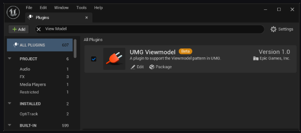

### C++创建viewModel

继承UMVVMViewModelBase 类即可

依赖FieldNotify变量和函数将更改广播给绑定到它们的控件。


需要被绑定的变量会使用到如下描述符

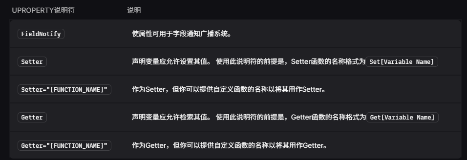

这里需要说明的是

如果对set get时没有什么特别的逻辑需求。那么可以不指定函数名甚至不显式实现函数。UHT会自动的生成对应的模板函数。并且在蓝图中访问时会走该函数。

但是如果在C++中不经过get set直接修改函数，其是不能够做到广播效果的

如果需要有特殊的逻辑，那么可以自己实现get set然后将函数名setter="function_name"的形式加上。以及不要设置为UFUNCTION  普通的就好


#### 带filedNotify说明符的函数

这个是为了做这种情形，比如说生命值百分比。但是我们不想做一个成员变量来给UI绑定。那么其实可以做一个对应的函数给组件绑定

但是这样的话就需要在比如说生命值的变化里主动调用这个函数。稍微有点麻烦，感觉不如加一个变量呢还是全自动的。但是变量也需要我手动算啊。反正有这么回事


#### 使用UE提供的宏来方便的判断是否产生了变化以及广播变化

其实底层也是广播的委托

属性转发宏本质上就是判断了新值和旧值是否变化了，如果变化了则广播。然后如果广播则会返回true

那么会执行下面的广播事件，将函数指针传入，会有MVVM系统去调用该函数。然后通知所有绑定了该函数的组件取值


```
UCLASS(BlueprintType)
    class UVMCharacterHealth : public UMVVMViewModelBase
    {
    GENERATED_BODY()

    private:
    UPROPERTY(BlueprintReadWrite, FieldNotify, Setter, Getter, meta=(AllowPrivateAccess))
        int32 CurrentHealth;

        UPROPERTY(BlueprintReadWrite, FieldNotify, Setter, Getter, meta=(AllowPrivateAccess))
        int32 MaxHealth;

    public:
        void SetCurrentHealth(int32 NewCurrentHealth)
        {
            if (UE_MVVM_SET_PROPERTY_VALUE(CurrentHealth, NewCurrentHealth))
            {
                UE_MVVM_BROADCAST_FIELD_VALUE_CHANGED(GetHealthPercent);
            }
        }

        void SetMaxHealth(int32 NewMaxHealth)
        {
            if (UE_MVVM_SET_PROPERTY_VALUE(MaxHealth, NewMaxHealth))
            {
                UE_MVVM_BROADCAST_FIELD_VALUE_CHANGED(GetHealthPercent);
            }

        }

        int32 GetCurrentHealth() const
        {
            return CurrentHealth;
        }

        int32 GetMaxHealth() const
        {
            return MaxHealth;
        }

    public:

        UFUNCTION(BlueprintPure, FieldNotify)

        float GetHealthPercent() const
        {
            if (MaxHealth != 0)
            {
                return (float) CurrentHealth / (float) MaxHealth;
            }
            else
                return 0;
        }

    };
```

C++里对属性变化进行广播差不多就是这样了


### 如何在UI里绑定viewModel

以及一个UI可以绑定多个viewmodel来获取不同的数据

这里只是选定了UI需要哪个类。但是其实还没有绑定实例

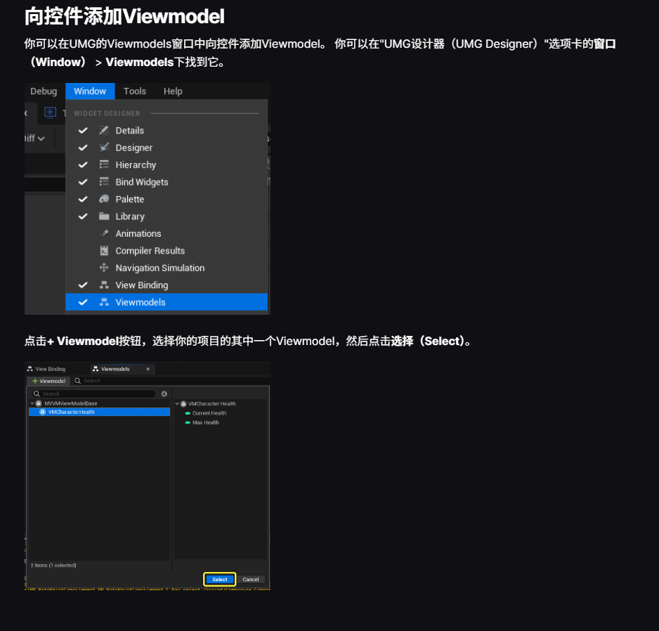

绑定的时候可以该变量名

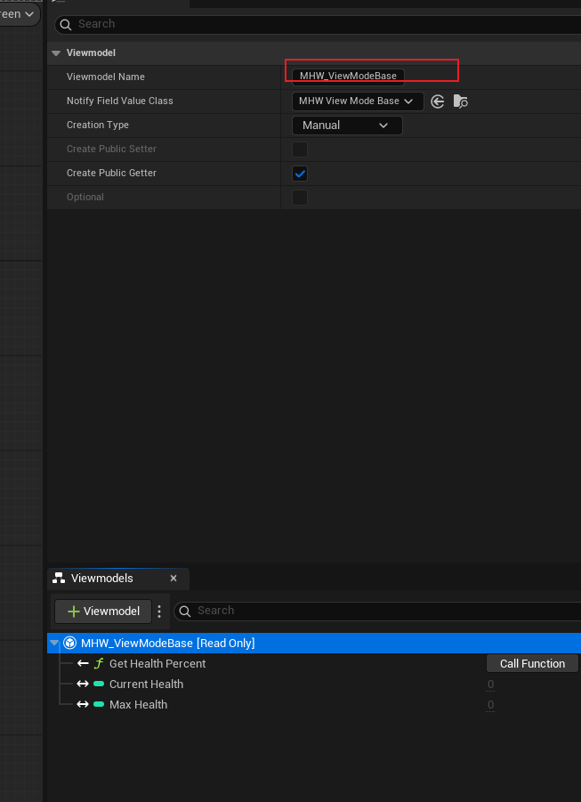

#### 添加实例的方式有多种

需要先在视图模型界面选中需要设置的viewmodel然后跳转到detail界面去设置实例化方式

下面会一一解析


每个控件都会有自己的viewmodel实例。相互间不互通，不感知

**UE只会在ViewModel为空时创建新实例，ViewModel会在PreConstruct和Construct事件之间创建。**

所以如果是创建实例的方式，要用这个实例的话再构造函数之后进行获取


就是一开始为空，需要在程序的某个位置手动赋值

然后赋值节点为

C++应该也有一样的


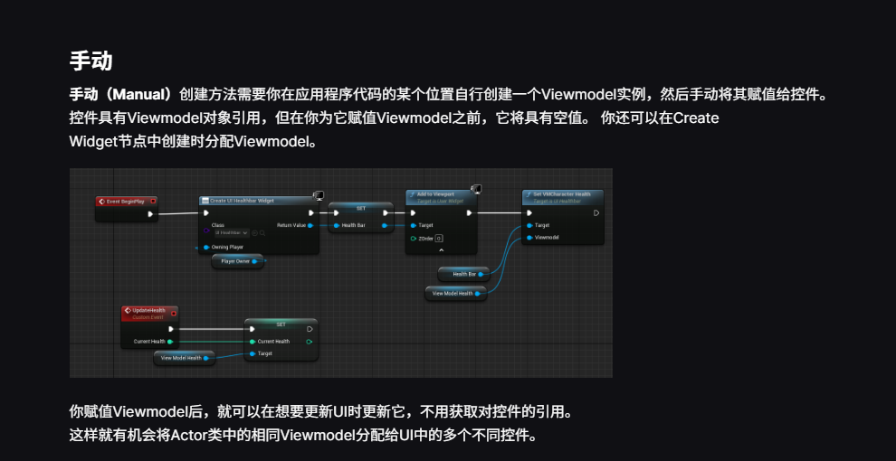


这个其实就是说相当于让其调用一个函数去获得videmodel  这种方式可能还挺好的。因为可以在基类中添加函数。这样所有的子类都可以填相同的，如果有需要的话重写就好了


这个其实就是将viewModel放到了全局数组里

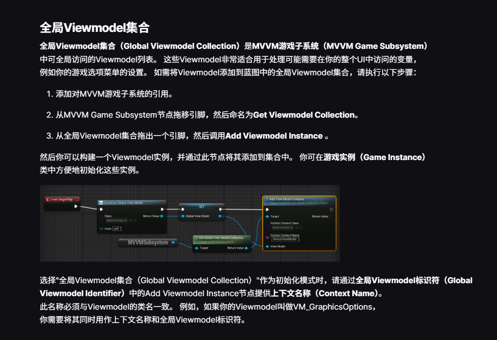

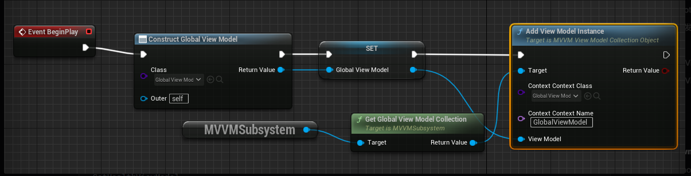

我看他们有人用法是 这里的identifier和contextname一致就可以找到

但是好像不是很好，毕竟官方说的是和类名一致 


```
所以同一个类的多个实例，推荐使用局部 Context：手动/创建实例 等方式

InventoryWidget → InventoryViewModel 实例 1
EquipmentWidget → InventoryViewModel 实例 2

而全局 Context 更适合：

GraphicsOptionsViewModel
AudioSettingsViewModel
PlayerProfileViewModel

这类整个游戏只需要一份的状态。
```


### 在配置好实例化后，可以在UI中以成员变量的方式访问viewModel  也不是实例化吧，就是加入了UI之后就可以访问了


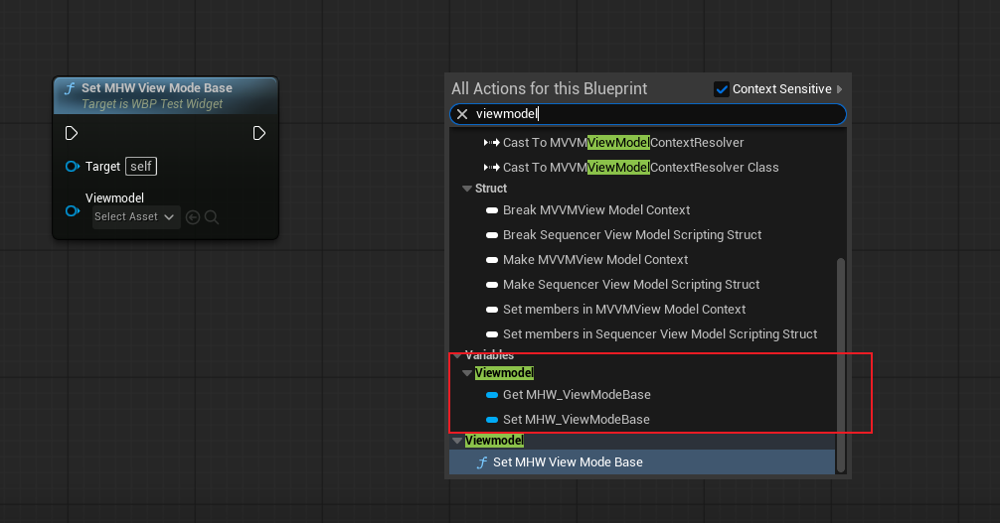


### viewModel添加数组变量?

他这里什么意思，没法通知数组变量吗  

喔喔，是说数组的增删没法主动检测到变化。这里就可以做函数来给他绑定


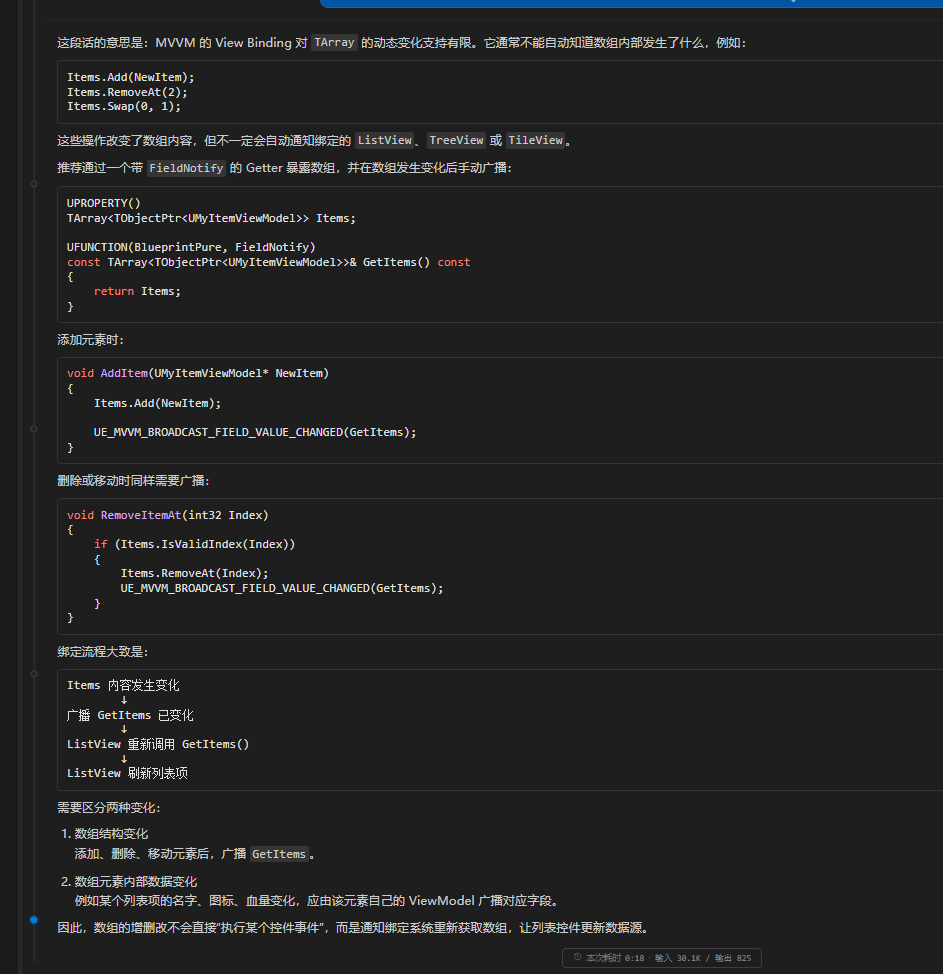


这里的第二种情况指的是  数组中的数据变化了。如果数组成员是viewmodel其就可以自己广播到需要他的组件上 而数组所在的viewmodel 看自己的需求是否广播


### 配置视图绑定

需要关一下旧版的绑定。说是因为旧版的绑定使用的是tick的形式，性能巨差，然后新版是用的蓝图可用多播委托。并且由于其绑定方式会和新版冲突，所以直接删掉就好

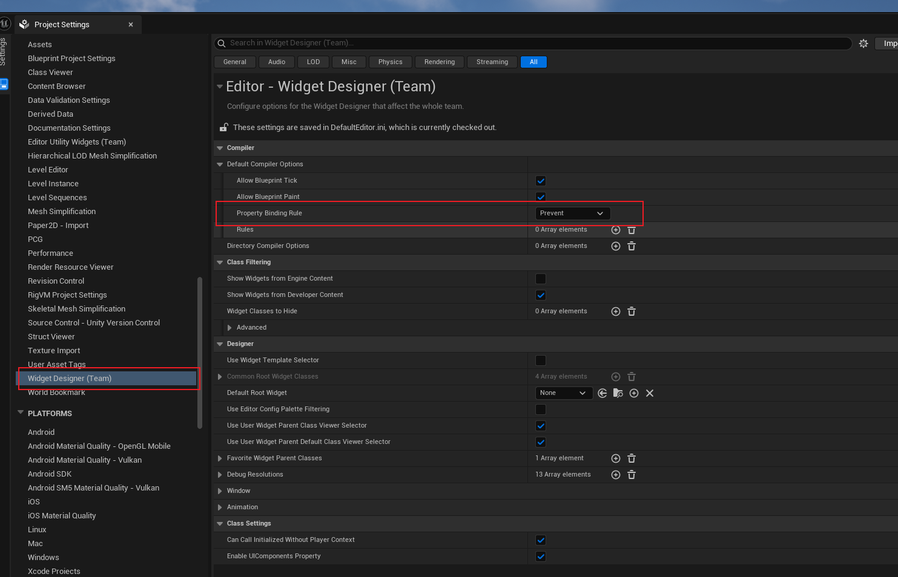


然后现在details里就只有  绑定到viewmodel了 

 


#### 再关闭一下viewmodel在详情面板中的绑定，让其只能在viewBanding界面绑定


#### 接下来就可以在viewBanding界面进行绑定了

这里选择控件再选择对应的viewmodel数据，如果数据类型不一致还需要转换函数来转换一下


#### 如果没有合适的转换函数，比如说自定义类型 那么可以手动写转换函数

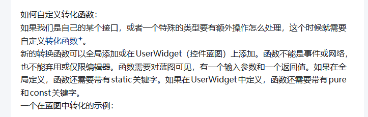


##### 如果要在C++中实现，需要放到蓝图可调用库里


```
在 C++ 中，全局可用的 MVVM 转换函数应放在继承自 UBlueprintFunctionLibrary 的函数库中，并满足：

static
UFUNCTION(BlueprintPure)
一个输入参数
一个返回值
不能是网络函数、事件、废弃函数或仅编辑器函数
例如，创建头文件：

// MHW_MVVMConversionLibrary.h
#pragma once

#include "CoreMinimal.h"
#include "Kismet/BlueprintFunctionLibrary.h"
#include "MHW_MVVMConversionLibrary.generated.h"

UCLASS()
class MHWR_REBUILD_API UMHW_MVVMConversionLibrary : public UBlueprintFunctionLibrary
{
    GENERATED_BODY()

public:
    UFUNCTION(BlueprintPure, Category="MVVM|Conversion")
    static float HealthToPercent(float Health);
};

实现：

// MHW_MVVMConversionLibrary.cpp
#include "MHW_MVVMConversionLibrary.h"

float UMHW_MVVMConversionLibrary::HealthToPercent(float Health)
{
    return FMath::Clamp(Health / 100.0f, 0.0f, 1.0f);
}

之后重新编译项目，在 View Binding 的转换函数列表中即可使用：

CurrentHealth
    ↓
HealthToPercent
    ↓
ProgressBar.Percent

如果转换需要多个数据，不能直接使用两个输入参数，因为 MVVM 转换函数要求一个输入参数。可以将多个值封装到结构体中：

USTRUCT(BlueprintType)
struct FHealthData
{
    GENERATED_BODY()

    UPROPERTY(BlueprintReadWrite)
    float Current = 0.0f;

    UPROPERTY(BlueprintReadWrite)
    float Max = 1.0f;
};

然后：

UFUNCTION(BlueprintPure, Category="MVVM|Conversion")
static float HealthDataToPercent(FHealthData Data);

此外，转换函数的输入和返回类型必须与绑定链路两端兼容。例如：

static FText IntToText(int32 Value);
static float IntToPercent(int32 Value);
static FLinearColor BoolToColor(bool bValue);

这里的“全局”是指该函数不依赖某个具体 UserWidget 实例，任何符合类型的 View Binding 都可以使用它。
```


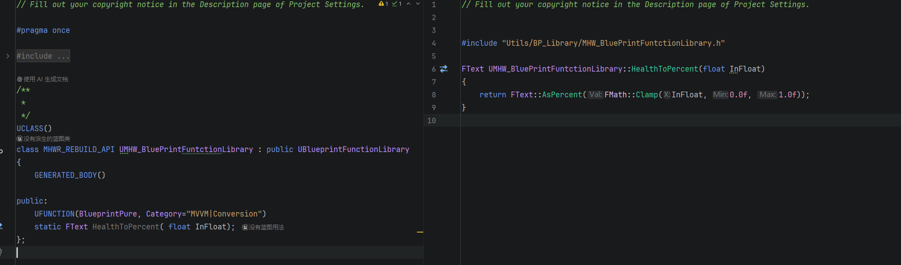


### 绑定对象不仅限于组件里的内容，自己的属性也是可以绑定的，只需要开启filedNotify就可以，包括C++继承来的属性也可以

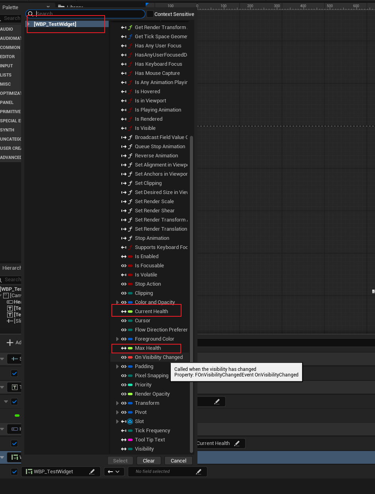

#### 以及这样单纯的绑定，结果只是数据会变化。但是如果我需要数据变化时触发自己的逻辑应该怎么做?

其实逻辑就和viewmodel的getter 和 setter类似。他们都是在数据变化时发送广播然后对应的收到广播的去调用对应属性的setter。在setter这里就可以执行的自己的逻辑。比如说如果在viewmodel里health的setter里可能会判断数据是否改变，然后其需要继续更新生命比例的值


但是蓝图里的health的setter只需要更新当前生命值文本就好  


蓝图/C++中的setter实现方式

我提供了一个native的虚函数给蓝图。蓝图重写这个函数来做自己想要的逻辑


由此我们可以自定义结构体类型，想传啥传啥

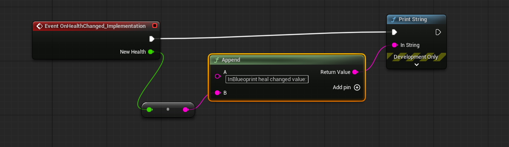


效果就是在属性值变化的时候打印了新值

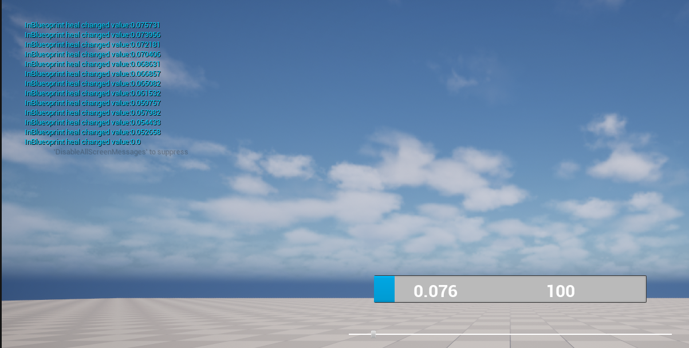

#### view的某个值在UI层修改了需要传递给绑定的viewmodel

那么可以手动调用广播

这是因为广播函数是在 接口中定义的 然后uuserwidget 继承了这个接口  这样才能做到数据发给viewmodel


**这里作为源头就需要做相等判断了，不然会无限循环的**

```
void SetMaxHealth(float NewMaxHealth)
	
{    
                if(MaxHealth != NewMaxHealth)
                {
                MaxHealth = NewMaxHealth;
		UE_MVVM_BROADCAST_FIELD_VALUE_CHANGED(MaxHealth);
                }
		
	}
```


### VIEW 和 viewmodel层双向绑定大概就是这样。但是viewmodel 是如何和model绑定起来的

AI如是说   让自己获取model对象 其和model之间是单项依赖的 viewmodel依赖于model 以委托获取传来的数据，以函数传递数据

```
UE5 的 MVVM 系统主要负责 View ↔ ViewModel，不会自动管理 Model ↔ ViewModel。Model 和 ViewModel 的同步通常由你自己通过委托、事件或接口实现。

推荐的数据流是：

Model 发生变化
    ↓
Model 广播委托
    ↓
ViewModel 更新自己的 FieldNotify 属性
    ↓
View 自动刷新

View 的输入
    ↓
ViewModel Setter/命令
    ↓
ViewModel 调用 Model 接口修改数据
    ↓
Model 广播变化

例如 Model：

DECLARE_MULTICAST_DELEGATE_OneParam(FOnHealthChanged, float);

class UHealthComponent : public UActorComponent
{
public:
	FOnHealthChanged OnHealthChanged;

	float GetHealth() const
	{
		return CurrentHealth;
	}

	void SetHealth(float NewHealth)
	{
		if (CurrentHealth == NewHealth)
		{
			return;
		}

		CurrentHealth = NewHealth;
		OnHealthChanged.Broadcast(CurrentHealth);
	}

private:
	float CurrentHealth = 100.0f;
};

ViewModel 持有 Model 引用，并监听它：

UCLASS()
class UMHW_HealthViewModel : public UMVVMViewModelBase
{
	GENERATED_BODY()

public:
	void Initialize(UHealthComponent* InHealthComponent)
	{
		HealthComponent = InHealthComponent;

		if (HealthComponent)
		{
			HealthComponent->OnHealthChanged.AddUObject(
				this,
				&ThisClass::HandleHealthChanged);

			HandleHealthChanged(HealthComponent->GetHealth());
		}
	}

	void SetHealth(float NewHealth)
	{
		if (HealthComponent)
		{
			HealthComponent->SetHealth(NewHealth);
		}
	}

private:
	void HandleHealthChanged(float NewHealth)
	{
		UE_MVVM_SET_PROPERTY_VALUE(CurrentHealth, NewHealth);
	}

	UPROPERTY(FieldNotify, Getter, Setter)
	float CurrentHealth = 0.0f;

	TObjectPtr<UHealthComponent> HealthComponent;
};

实际含义是：

Model → ViewModel：通过委托通知
ViewModel → Model：通过函数调用或接口修改
ViewModel → View：通过 FieldNotify 通知

注意不要让 ViewModel 直接持有 Widget 引用，但 ViewModel 持有 Model 引用是正常的，因为 ViewModel 本质上就是 Model 面向 UI 的适配层。

还需要在 ViewModel 销毁或切换 Model 时解绑委托，避免回调访问失效对象。对于 Actor、Component 等 UE 对象，推荐使用 TObjectPtr、TWeakObjectPtr 和 AddUObject/RemoveAll 管理生命周期。
```

## 游戏存档笔记


